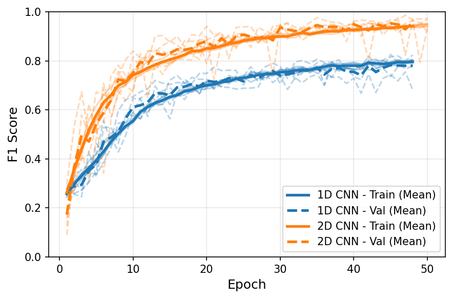
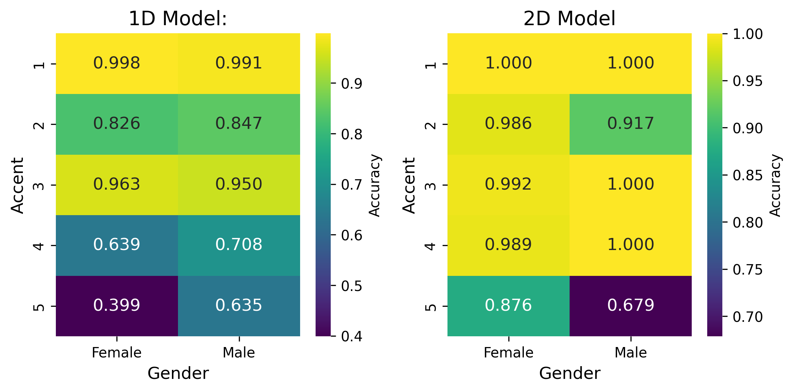

# Accent Classification Project

## Overview
This repository contains code and resources for training neural networks to classify different accents. The project implements a 1D CNN model processing raw audio waveforms, with plans for a 2D CNN spectrogram-based model.

- [Accent Classification Project](#accent-classification-project)
  - [Overview](#overview)
  - [Dataset](#dataset)
  - [Model 1: Raw Audio (1D)](#model-1-raw-audio-1d)
    - [Architecture:](#architecture)
    - [Training Pipeline:](#training-pipeline)
    - [Usage](#usage)
  - [Model 2: 2D Spectrogram (WIP)](#model-2-2d-spectrogram-wip)
    - [Architecture:](#architecture-1)
    - [Training Pipeline:](#training-pipeline-1)
    - [Usage](#usage-1)
  - [Results](#results)
    - [Model 1: Raw Audio (1D CNN)](#model-1-raw-audio-1d-cnn)
    - [Model 2: log-Melspectogram (2D CNN)](#model-2-log-melspectogram-2d-cnn)
    - [Comparison of Model 1 and Model 2](#comparison-of-model-1-and-model-2)

## Dataset
- **Format**: Audio samples as mono-channel WAV files at 16kHz sample rate
- **Classes**: 5 accent classes (numbered 1-5 in filenames)

- Dataset is not included in the repository. Users must download the dataset separately and place it in the `data/` folder. Resulting directory structure should be:
```
data/
├── Train
│   ├── 1f_1018.wav
│   ├── 1f_1026.wav
│   ├── ...
├── Test set
│   ├── 1035.wav
│   ├── 1074.wav
│   ├── ...
```

## Model 1: Raw Audio (1D)
- Implemented in [`models/cnn_1d_raw_audio.py`](models/cnn_1d_raw_audio.py)
- Trainable with [`train_1d_raw.py`](train_1d_raw.py)
- Uses a 1D convolutional architecture directly on raw audio waveforms

### Architecture:
- **Input**: Raw audio waveforms (80000 samples at 16kHz)
- **Convolutional Blocks**: 
  - **Block 1**: 16 filters → BatchNorm → ReLU → MaxPool(4) → Dropout
  - **Block 2**: 32 filters → BatchNorm → ReLU → MaxPool(4) → Dropout
  - **Block 3**: 64 filters → BatchNorm → ReLU → AdaptiveMaxPool → Dropout
- **Output**: Fully connected layer with 5 neurons (one per accent class)
- **Kernel Size**: 9 with padding of 4 for all convolutional layers
- **Dropout**: Configurable rate (optimized via hyperparameter search)

### Training Pipeline:
- **Hyperparameter Optimization**: Uses Optuna to search for optimal training parameters
- **Cross-Validation**: 5-fold CV during hyperparameter search
- **Metrics**: Loss, Accuracy, and F1 score tracked during training
- **Optimization**: Adam optimizer with weight decay for regularization
- **Pruning**: Early stopping of ineffective trials to speed up optimization
- **Final Model Training**: Uses best hyperparameters to train on all available data
- **Learning Rate Schedule**: Step decay scheduling during final training

### Usage
1. Install dependencies via `pip install -r requirements.txt`
2. Place `.wav` files in the `data/Train` folder
3. Run `python train_1d_raw.py` to start training
4. Generate predictions on test data using `python evaluate_1d_raw.py`

## Model 2: 2D Spectrogram (WIP)
- Implemented in [`models/cnn_2d_spectrogram.py`](models/cnn_2d_spectrogram.py)
- Trainable with [`train_2d_spec.py`](train_2d_spec.py)
- Uses 2D CNN architecture on log-mel spectrograms

### Architecture:
- **Input**: Log-Mel Spectrograms derived from raw audio (1 × 128 × 500)
- **Convolutional Blocks**: 
  - **Block 1**: 16 filters → BatchNorm → ReLU → MaxPool → Dropout
  - **Block 2**: 32 filters → BatchNorm → ReLU → MaxPool → Dropout
  - **Block 3**: 64 filters → BatchNorm → ReLU → MaxPool → Dropout
  - **Block 4**: 128 filters → BatchNorm → ReLU → AdaptiveAvgPool → Dropout
- **Output**: Fully connected layer with 5 neurons (one per accent class)
- **Dropout**: Configurable rate (optimized via hyperparameter search)

### Training Pipeline:
- **Feature Extraction**: Raw audio converted to log-mel spectrograms
- **Hyperparameter Optimization**: Uses Optuna to search for optimal training parameters
- **Cross-Validation**: 5-fold CV during hyperparameter search
- **Metrics**: Loss, Accuracy, and F1 score tracked during training
- **Optimization**: Adam optimizer with weight decay for regularization
- **Learning Rate Schedule**: ReduceLROnPlateau scheduler for adaptive learning rate
- **Final Model Training**: Uses best hyperparameters to train on all available data

<!-- Example picture Figures/spectogram_example.png -->
<div align="center">
  
  <p><i>Example of a log-mel spectrogram extracted from an audio sample, showing time on the x-axis and frequency on the y-axis. The model processes these 2D representations to identify accent patterns.</i></p>
</div>

### Usage
1. Install dependencies via `pip install -r requirements.txt`
2. Place `.wav` files in the `data/Train` folder
3. Run `python train_2d_spec.py` to start training
4. Generate predictions on test data using `python evaluate_2d_spec.py`

### Results
#### Model 1: Raw Audio (1D CNN)
- **Performance**:
  - Mean Cross-validated F1 Score: 0.806
  - Test set F1 Score: 0.751

<div align="center">
  
  <p><i>Cross-validation performance for the 1D CNN model. The plot shows consistent F1 scores across training and validation sets throughout the k-fold process, demonstrating robust generalization with minimal gap between training and validation metrics.</i></p>
</div>

#### Model 2: log-Melspectogram (2D CNN)
- **Performance**:
  - Mean Cross-validated F1 Score: 0.970
  - Test set F1 Score: 0.925

<div align="center">
  
  <p><i>Cross-validation performance for the 2D CNN model. The closely aligned training and validation F1 scores across all folds indicate excellent generalization capability without overfitting, despite the model's higher complexity.</i></p>
</div>

#### Comparison of Model 1 and Model 2
|        | 2D CNN                 |                         |           | 1D CNN                 |                         |           |
|--------|------------------------|-------------------------|-----------|------------------------|-------------------------|-----------|
| Metric | Train                  | Val                     | Test      | Train                  | Val                     | Test      |
| Acc    | 0.938                  | 0.970                   | –         | 0.793                  | 0.811                   | –         |
| F1     | 0.937                  | 0.970                   | 0.925     | 0.790                  | 0.806                   | 0.751     |
| Loss   | 0.182                  | 0.135                   | –         | 0.535                  | 0.535                   | –         |

Metrics averaged across five folds, using the epoch with the highest validation F1-score in each fold and results on the test set.


The 2D CNN model consistently outperforms the 1D CNN across all folds, demonstrating superior feature extraction capabilities from the spectrogram representations compared to raw audio processing.

<div align="center">
  
  <p><i>Comparison of 1D CNN (blue) and 2D CNN (orange) F1 scores across 5-fold cross-validation. The graph shows both mean performance (bold lines) and individual fold results (transparent lines). </i></p>
</div>

The 1D CNN performs reasonably well for certain accent-gender combinations particularly for accents 1 and 3. However, its performance deteriorates for more challenging accents, most notably accent 5, where accuracy drops significantly, especially for female speakers (0.399). In contrast, the 2D CNN exhibits consistently higher accuracy across almost all categories. It achieves perfect classification for multiple accent-gender pairs and significantly improves performance for difficult classes, such as accent 5 (female: 0.876), although some performance gap remains for male speakers of accent 5 (0.679).

<div align="center">
  
  <p><i>Figure 4: Per-accent and per-gender accuracy comparisons between the 1D and 2D CNN models.</i></p>
</div>